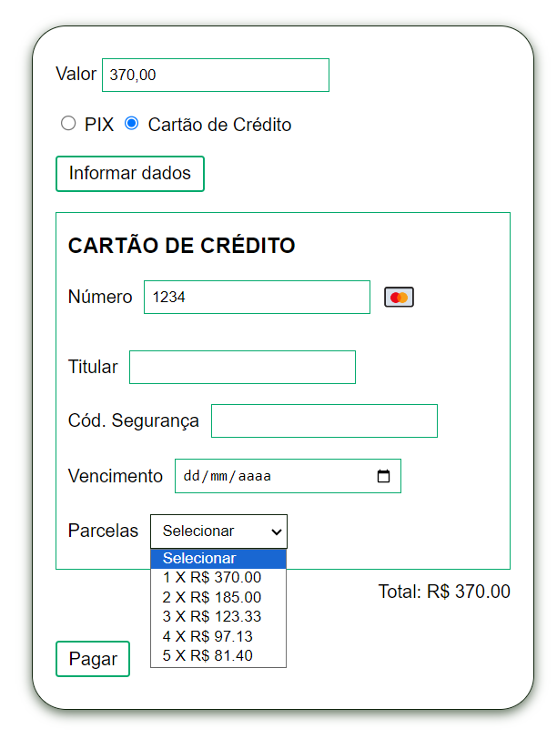

# Pagamento

Meu objetivo com esse mini projeto é aprender como usar a biblioteca JQuery do JavaScript.

Tela de pagamento com opção pix e cartão de crédito, os dados que aparecem são atualizados e tratados em tempo de execução, com um evento para "escutar" quando o usuário clica no botão.

## Pix

## Cartão de crédito

No campo *Número*: 
* 1234 - bandeira mastercard.
* 4321 - bandeira visacard.

No campo *Parcelas* o total é ajustado comforme o juros aplicado sobre as parccelas.